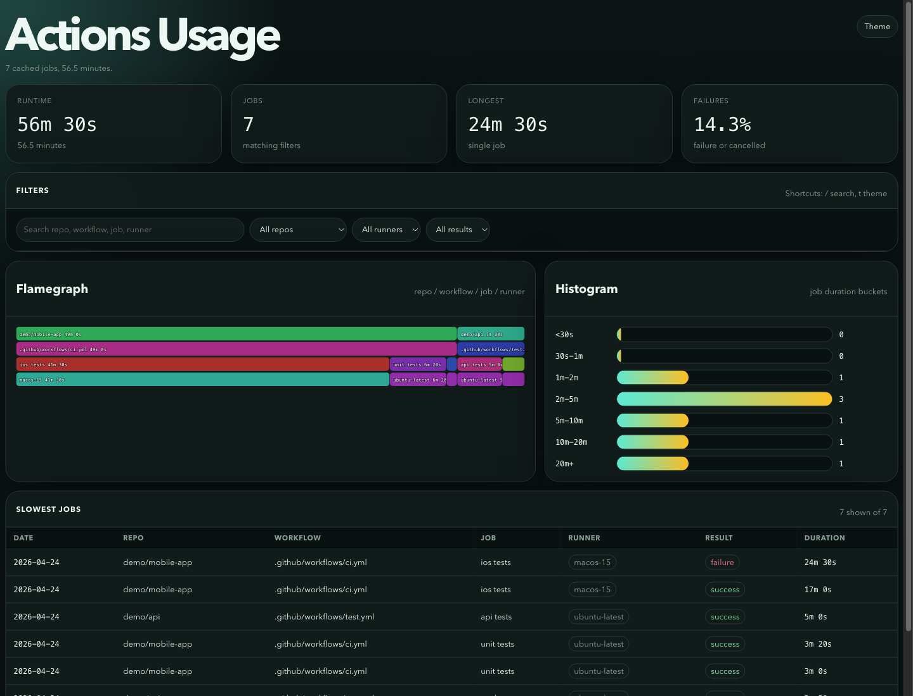

# gh-actions-usage: cached Actions analytics demo

*2026-04-24T22:27:57Z by Showboat 0.6.1*
<!-- showboat-id: 2a1c0fea-a6af-46a9-98a2-2b2e33a47da6 -->

This demo exercises the CLI without calling GitHub. It imports a checked-in export fixture, proves repeated imports are idempotent at the SQLite layer, slices runtime by runner image, and opens the embedded dashboard with Rodney.

```bash
set -euo pipefail
export GH_ACTIONS_USAGE_CACHE=/tmp/gh-actions-usage-showboat-import.db
rm -f "$GH_ACTIONS_USAGE_CACHE" "$GH_ACTIONS_USAGE_CACHE-shm" "$GH_ACTIONS_USAGE_CACHE-wal"
printf "cache=%s\n" "$GH_ACTIONS_USAGE_CACHE"
go run . import --in testdata/demo-export.json --json | jq "{repos_imported,runs_imported,jobs_imported}"
go run . import --in testdata/demo-export.json --json | jq "{repos_imported,runs_imported,jobs_imported}"
go run . cache stats | jq .
```

```output
cache=/tmp/gh-actions-usage-showboat-import.db
{
  "repos_imported": 2,
  "runs_imported": 3,
  "jobs_imported": 7
}
{
  "repos_imported": 2,
  "runs_imported": 3,
  "jobs_imported": 7
}
{
  "billing_usage": 0,
  "jobs": 7,
  "repos": 2,
  "runs": 3
}
```

The two import commands read the same seven jobs. The cache count stays at one row per GitHub ID, so the data loader can be rerun safely.

```bash
set -euo pipefail
export GH_ACTIONS_USAGE_CACHE=/tmp/gh-actions-usage-showboat-summary.db
rm -f "$GH_ACTIONS_USAGE_CACHE" "$GH_ACTIONS_USAGE_CACHE-shm" "$GH_ACTIONS_USAGE_CACHE-wal"
go run . import --in testdata/demo-export.json >/dev/null
go run . summary --group-by date,repo,workflow-path,runner-os,runner-image
```

```output
jobs: 7
runs: 3
runtime: 56.5 minutes
date        repo             workflow-path               runner-os  runner-image   jobs  minutes  avg     longest
2026-04-24  demo/mobile-app  .github/workflows/ci.yml    macOS      macos-15       2     41.5     20m45s  24m30s
2026-04-24  demo/api         .github/workflows/test.yml  Linux      ubuntu-latest  2     7.5      3m45s   5m0s
2026-04-24  demo/mobile-app  .github/workflows/ci.yml    Linux      ubuntu-latest  3     7.5      2m30s   3m20s
```

The fixture makes the expensive case obvious: two macOS jobs consume most of the runtime, while the Linux jobs are cheaper and shorter.

```bash
set -euo pipefail
export GH_ACTIONS_USAGE_CACHE=/tmp/gh-actions-usage-showboat-jobs.db
rm -f "$GH_ACTIONS_USAGE_CACHE" "$GH_ACTIONS_USAGE_CACHE-shm" "$GH_ACTIONS_USAGE_CACHE-wal"
go run . import --in testdata/demo-export.json >/dev/null
go run . jobs list --limit 4
```

```output
started     repo             workflow                    job         runner         result   duration
2026-04-24  demo/mobile-app  .github/workflows/ci.yml    ios tests   macos-15       failure  24m30s
2026-04-24  demo/mobile-app  .github/workflows/ci.yml    ios tests   macos-15       success  17m0s
2026-04-24  demo/api         .github/workflows/test.yml  api tests   ubuntu-latest  success  5m0s
2026-04-24  demo/mobile-app  .github/workflows/ci.yml    unit tests  ubuntu-latest  success  3m20s
```

The dashboard reads the same cache through /api/summary and /api/jobs. Rodney opens the page, asserts that cached rows rendered, and captures the screenshot below.

```bash
set -euo pipefail
export GH_ACTIONS_USAGE_CACHE=/tmp/gh-actions-usage-showboat-ui.db
export RODNEY_HOME=/tmp/gh-actions-usage-showboat-rodney
rm -rf "$RODNEY_HOME"
rm -f "$GH_ACTIONS_USAGE_CACHE" "$GH_ACTIONS_USAGE_CACHE-shm" "$GH_ACTIONS_USAGE_CACHE-wal"
server_pid=""
cleanup() {
  if [ -n "$server_pid" ]; then
    kill "$server_pid" 2>/dev/null || true
  fi
  uvx rodney stop >/tmp/gh-actions-usage-rodney-stop.out 2>/dev/null || true
}
trap cleanup EXIT

go run . import --in testdata/demo-export.json >/dev/null
(go run . serve --listen 127.0.0.1:18184 >/tmp/gh-actions-usage-demo-server.out 2>/tmp/gh-actions-usage-demo-server.err & echo $! >/tmp/gh-actions-usage-demo-server.pid)
server_pid="$(cat /tmp/gh-actions-usage-demo-server.pid)"
ready=0
for _ in $(seq 1 40); do
  if curl -fsS http://127.0.0.1:18184/api/summary >/tmp/gh-actions-usage-demo-summary.json 2>/dev/null; then
    ready=1
    break
  fi
  sleep 0.25
done
if [ "$ready" -ne 1 ]; then
  cat /tmp/gh-actions-usage-demo-server.err >&2
  exit 1
fi
uvx rodney start >/tmp/gh-actions-usage-rodney-start.out
uvx rodney open http://127.0.0.1:18184/ >/tmp/gh-actions-usage-rodney-open.out
uvx rodney wait "#flamegraph" >/tmp/gh-actions-usage-rodney-wait.out
uvx rodney assert "document.body.innerText.includes(\"Actions Usage\")" true >/tmp/gh-actions-usage-rodney-assert1.out
uvx rodney assert "document.querySelectorAll(\"#table tr\").length > 1" true >/tmp/gh-actions-usage-rodney-assert2.out
uvx rodney js "({title: document.title, rows: document.querySelectorAll(\"#table tr\").length})"
uvx rodney screenshot -w 1440 -h 1100 docs/assets/dashboard.png
```

```output
{
  "rows": 7,
  "title": "GH Actions Usage"
}
docs/assets/dashboard.png
```

```bash {image}

```


